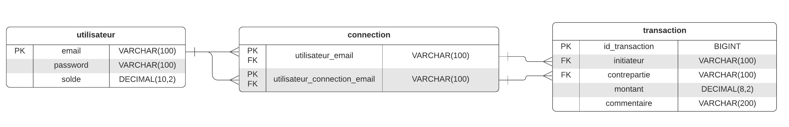

# PayMyBuddy
Welcome to PayMyBuddy Application !

PayMyBuddy is a web financial application which goal is to allow users to perform financial transactions : wire and withdraw amount to and from an external account and perform transactions to connections that are users of the application as well.

You will find in this repository the Data Access Layer for the application, including repository and service layers, as well as the database initialization file.

The code is written in Java and use Maven for project build, dependencies management and tests running. A PostgreSQL database is used to store the data.

## Getting Started

These instructions will get you a copy of the project up and running on your local machine for development and testing purposes. See deployment for notes on how to deploy the project on a live system.

### Prerequisites

You need to install the following software :

- Java 1.8
- Maven 3.6.2
- PostgreSQL 12

### Installing

A step by step explanation that tell you how to get a development environment running:

1. Install Java:
<https://docs.oracle.com/javase/8/docs/technotes/guides/install/install_overview.html>

2. Install Maven:
<https://maven.apache.org/install.html>

3. Install PostgreSQL :
<https://www.postgresqltutorial.com/install-postgresql>

### Branches

The most up to date branch is the **develop** branch.
This develop branch is ready for code review.

You also have the following **features** branches including the described features :

feature_repositoryJDBC :
- this branch contains the model (entities) and the repository layer (DAO) 
- the data persistence is done using the **JDBC API** 
- the Repository Pattern is implemented (there is an Interface implemented by a concrete class and a factory to build the repository objects)

feature_repositoryJPA :
- this branch contains the model and the repository layer
- the data persistence is done using the **JPA API** 
- the Repository Pattern is implemented

feature_repositoryJDBCandJPA :
- this branch contains the model and the repository layer
- the branch regroup the JDBC and JPA persistence
- the Repository Interface is implemented by both **JDBC and JPA** persistence concrete class 
- a parameterized factory enables to choose the data persistence

> This branch is a demonstration of the Repository Pattern : a same interface is implemented by two different persistence versions and a factory allows to choose the implementation used.

feature_RepositoryJPAndServiceTxHibernate :
- this branch contains the model, the repository layer and the service layer
- the persistence of data implements the JPA API
- the transactions are managed using the Hibernate Transaction API 
- factories are used to build repository and service objects
	
> The develop branch is similar to this one.
	
You can import these branches in your favorite IDE.

> **WARNING** :If you are using Eclipse, you may have errors in the code due to the fact that the Java version is not correctly configured. To correct this issue, please right click on the project name and go to : *Properties/JavaCompiler* and ensure that the JDK/JRE version used is the **1.8**

### Configuration

1 - Configuration file :
- Within the **develop** branch, a configuration file called *'paymybuddy.properties'* is used to configure the application. This file is located in the *src/main/resources* directory.

> The goal of this configuration file is mainly to avoid to have these elements hard coded in the Java code. This feature enhances the security of the application.

This configuration file contains the following elements :
- **hibernate.connection.url** : the url of the database
	= *jdbc:postgresql://localhost/PayMyBuddyProd* by default
- **hibernate.connection.driver_class** : the name of the driver used to access to the database from the Java code = *org.postgresql.Driver* by default
- **hibernate.connection.username** : the username for the connection to the database
- **hibernate.connection.password** : the password corresponding to the username provided
 
> The first two elements are already filled-in in the file, please ensure to fill-in yourself username and password corresponding to your configuration.

- With respect to other **feature** branches : for **JDBC** you need to update the *'paymybuddy.properties'* configuration file and for **JPA** you need to update the *'persistence.xml'* configuration file.

2 - Database creation and initialization :
- First you need to create a database called : *PayMyBuddyProd*
- Then you need to grant the rights to this database to the user configured in the previous section 
- Finally  you need to launch the SQL file called *'DatabaseInitialization.sql'*

> This file is used to create the tables and populate some first elements.

### Features
The layers developed on this repository allow to perform the following actions :

On the **'user'** side :
- a user can register to the application by providing an email not already existing and a password
- a user can connect to the application by providing an existing email and the corresponding password
- a user can wire amount from an external account to its PayMyBuddy account, provided that the wired amount is positive
- a user can withdraw amount from its PayMyBuddy account to an external account, provided that the withdrawal amount is positive and the user balance is sufficient
- a user can add another user to its connections, provided that the connection is registered to the application and that they are not already connected

On the **'transaction'** side :
- a user can make a transaction to one of its connection, provided that they are connected, the amount of the transaction is positive and the user balance is sufficient
- we can get all transactions for an user in order to display them  

### JAR packaging

You can produce a JAR file containing the classes of the application, by running the below command :

`mvn clean install`

### Logging

The tool Logback is used for logging. Logs are sent to the console and to a file.

You can configure the logging to your own needs by using the configuration file : *'logback.xml'*.

### Tests

Unit and/or Integration tests are included in each branch.

You can run them using JUnit runner (`Run as JUnit test`) or using Maven (`Run as Maven test`).

>You may have to add the JUnit5 Library in your Build Path for JUnit tests runner.

Before launching the tests, you need to create a database called : *PayMyBuddyTest* and to fill-in the *'paymybuddyTest.properties'* accordingly (same thins as explained previously for the Production database).

There are dedicated SQL files for database initialization and preparation : *'CleanDBForTests.sql'* and *'DataTransactionsForTests.sql'*. In the **develop** branch, these files are automatically launched before tests so you have nothing to do on your side.

For the **JDBC** and **JPA feature** branches, you have to update the database connection data, in the method called 
*setUpAllTest()*, in order for tests to be able to launch these files.

### DataBase Schema

You will find below the Database conception schema :

